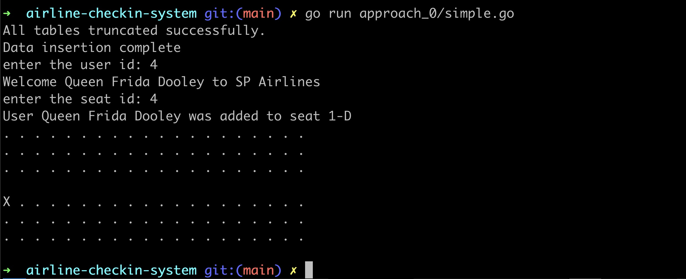
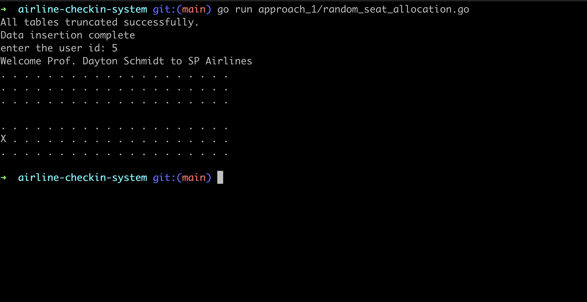
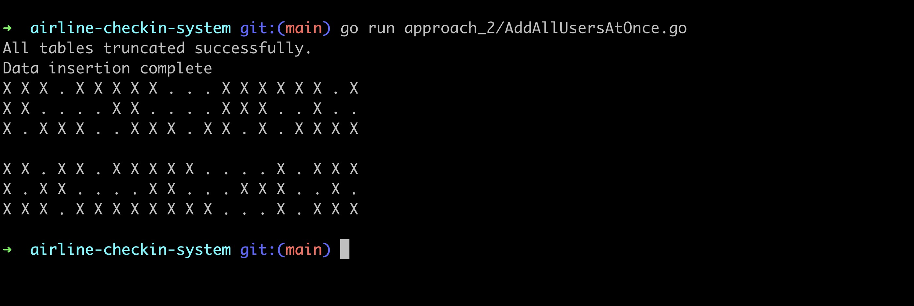
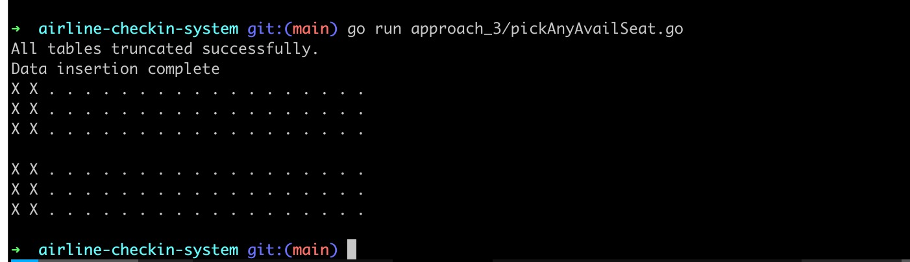
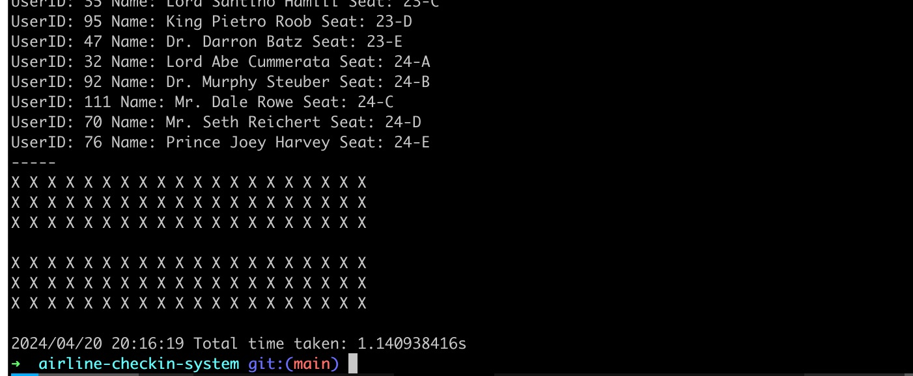
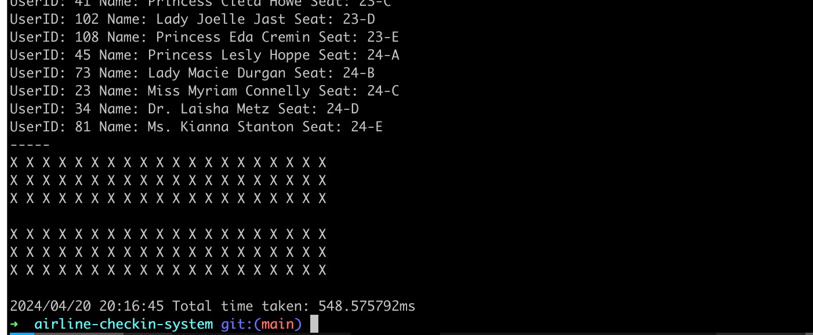

### Airline reservation system

## How to run

Give permission to postgres-init to execute script to create users

```shell
chmod +x ./postgres-init/*.sh
```

start the docker to run the 2 postgres databases

```shell
docker-compose up --build
```

## Approach zero

Get the user and seat from command line and add user to seat.Here there is no
check if the seat was already occupied or not. A seat that is already occupied
by a user can be overrwritten by another user.

```shell
go run approach_0/simple.go
```



## Approach one

Get the user from command line and randomly select a seat out of the 120 seats.
Here there no check if the seat was already occupied or not. A seat that is already occupied
by a user can be overrwritten by another user if the randomly choosen seat is
repeated.

```shell
go run approach_1/random_seat_allocation.go
```



## Approach two

Get all users from database and randomly select a seat out of the 120 seats.
Here there no check if the seat was already occupied or not. A seat that is already occupied
by a user can be overrwritten by another user if the randomly choosen seat is
repeated.

```shell
go run approach_2/AddAllUsersAtOnce.go
```



## Approach three

Get all the users from the database.
Sort the seats by ID and get the first seat where user ID is null and a user to
that seat. Here as there are no locks, 2 separate transaction can start and get
the same seat ID and both transaction can commit one after the other. Thus a
a seat allocated to a user can be overwritten by the last transaction that got
the same seat ID.

```shell
go run approach_3/pickAnyAvailSeat.go
```



## Approach four

Same as approach three but now ensure each row is locked before selecting a
seat record where user ID is null. As the rows are locked, there could be a case
where all the n users lock the first available seat and then all the n-1 users lock the
next available seat

```shell
go run approach_4/applyCorrectnessUsingLock.go
```



## Approach five

Same as approach four but now ensure to skip locked rows before selecting a free
seat. This reduced time for me from 1 minute 14 sec to 548 ms.

```shell
go run approach_5/skipTheLockedRows.go
```


